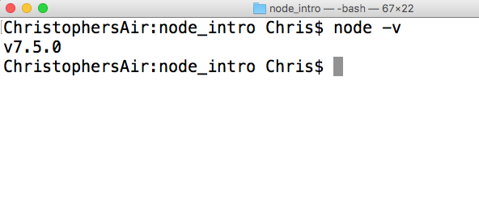

# Node Intro
Setup a server using Node & Express. The video that accompanies this tutorial can be found [here](https://youtu.be/XfQ0lVgdox4). In this tutorial we will:
- [ ] Confirm node is installed
- [ ] Initialize node
- [ ] Install required modules (Express & jQuery)
- [ ] Create the folder Structure
- [ ] Add basic HTML content in `index.html`
- [ ] Set up our node server in `app.js`
- [ ] Link to our `client.js` and log to the console
- [ ] Check in our code to GitHub

## Prerequisites
Node and Git must be installed on your computer. To check to see if you have node:
1. Open terminal
2. Type `$` `node -v` to see if you have node installed. If you already have node installed, skip the following steps.
> **Intalling Node**
>
> _Note: This process may take 10 - 30 minutes depending on your internet speed._
> 1. Install home brew (https://brew.sh/) by typing
>> `$` `/usr/bin/ruby -e "$(curl -fsSL https://raw.githubusercontent.com/Homebrew/install/master/install)"`
> 2. Install node by typing
>> `$` `brew install node`
> 3. Confirm you have node installed by typing
>> `$` `node -v`
>
>

## Setup Node
- `$` `mkdir node_intro`
- `$` `cd node_intro`
- `$` `npm init`
- `$` `npm install express --save`
- `$` `npm install jquery --save`
- `$` `atom .`

## Add Folder Structure
```
node_intro/
├── server/
│   ├── public/
│   │   ├── scripts/
│   │   │   └── client.js
│   │   ├── vendors/
│   │   │   └── jquery.js
│   │   ├── index.html
│   │   └── style.css
│   └── app.js
├── node_modules/
│   ├── express/
│   ├── jquery/
│   └── ...
└── .gitignore
```
